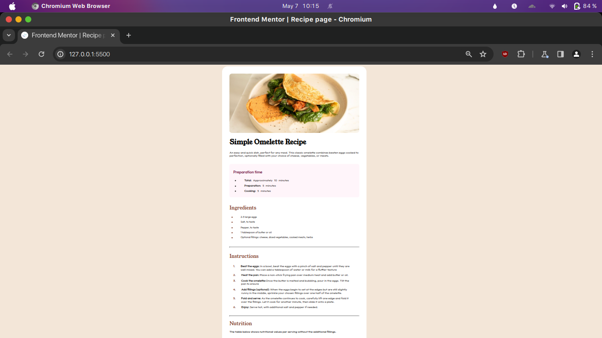

# Frontend Mentor - Recipe page solution

This is a solution to the [Recipe page challenge on Frontend Mentor](https://www.frontendmentor.io/challenges/recipe-page-KiTsR8QQKm). Frontend Mentor challenges helped me improve my coding skills by building realistic projects. 

## Table of contents

- [Overview](#overview)
  - [The challenge](#the-challenge)
  - [Screenshot](#screenshot)
  - [Links](#links)
- [My process](#my-process)
  - [Built with](#built-with)
  - [What I learned](#what-i-learned)
- [Author](#author)


## Overview

### Screenshot




### Links

- Solution URL: [recipe-page-main (GitHub)](https://github.com/Shubhojit-Mitra/recipe-page-main.git)
- Live Site URL: [recipe-page-main (GitHub Pages)](https://shubhojit-mitra.github.io/recipe-page-main/)

## My process

### Built with

- Semantic HTML5 markup
- CSS custom properties
- Flexbox

### What I learned

I learned to create HTML tables and also learned how to style tables in CSS.

```html
<div class="nutrition">
  <h2>Nutrition</h2>
  <table>
    <tr>
      <th>Calories</th>
      <td>277kcal</td>
    </tr>
    <tr>
      <th>Carbs</th>
      <td>0g</td>
    </tr>
    <tr>
      <th>Protein</th>
      <td>20g</td>
    </tr>
    <tr>
      <th>Fat</th>
      <td>22g</td>
    </tr>
  </table>
</div>
```
```css
.nutrition table {
    width: 100%;
}

th, td {
    padding: 15px;
    border-bottom: 1px solid var(--LightGrey);
}

.nutrition table tr:last-child th, 
.nutrition table tr:last-child td {
    border-bottom: none;
}

.nutrition table tr th {
    text-align: left;
    padding-left: 40px;
    width: 50%;
    font-weight: normal;
}

.nutrition table tr td {
    font-weight: 1000;
    color: var(--Nutmeg);
}or: papayawhip;
}
```

## Author

- LinkedIn - [Shubhojit Mitra](https://www.linkedin.com/in/shubhojit-mitra-dev)
- Frontend Mentor - [@shubhojit-mitra](https://www.frontendmentor.io/profile/shubhojit-mitra)

